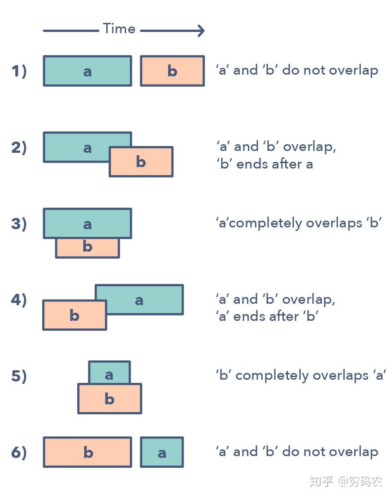

### Pattern: Merge Intervals，区间合并类型

区间合并模式是一个用来处理有区间重叠的很高效的技术。在设计到区间的很多问题中，通常咱们需要要么判断是否有重叠，要么合并区间，如果他们重叠的话。这个模式是这么起作用的：

给两个区间，一个是a，另外一个是b。别小看就两个区间，他们之间的关系能跑出来6种情况。详细的就看图啦。



经典题目：

1. Merge Intervals (medium)

```js
合并区间
给出一个区间的集合，请合并所有重叠的区间。

示例 1:

输入: [[1,3],[2,6],[8,10],[15,18]]
输出: [[1,6],[8,10],[15,18]]
解释: 区间 [1,3] 和 [2,6] 重叠, 将它们合并为 [1,6].
示例 2:

输入: [[1,4],[4,5]]
输出: [[1,5]]
解释: 区间 [1,4] 和 [4,5] 可被视为重叠区间。
```

2. Insert Interval (hard)

```js
插入区间
给出一个无重叠的 ，按照区间起始端点排序的区间列表。

在列表中插入一个新的区间，你需要确保列表中的区间仍然有序且不重叠（如果有必要的话，可以合并区间）。

 

示例 1：

输入：intervals = [[1,3],[6,9]], newInterval = [2,5]
输出：[[1,5],[6,9]]
示例 2：

输入：intervals = [[1,2],[3,5],[6,7],[8,10],[12,16]], newInterval = [4,8]
输出：[[1,2],[3,10],[12,16]]
解释：这是因为新的区间 [4,8] 与 [3,5],[6,7],[8,10] 重叠。
```

3. Intervals Intersection (medium)

```js
 区间列表的交集
给定两个由一些 闭区间 组成的列表，每个区间列表都是成对不相交的，并且已经排序。

返回这两个区间列表的交集。

（形式上，闭区间 [a, b]（其中 a <= b）表示实数 x 的集合，而 a <= x <= b。两个闭区间的交集是一组实数，要么为空集，要么为闭区间。例如，[1, 3] 和 [2, 4] 的交集为 [2, 3]。）

 

示例：


输入：A = [[0,2],[5,10],[13,23],[24,25]], B = [[1,5],[8,12],[15,24],[25,26]]
输出：[[1,2],[5,5],[8,10],[15,23],[24,24],[25,25]]
 

提示：

0 <= A.length < 1000
0 <= B.length < 1000
0 <= A[i].start, A[i].end, B[i].start, B[i].end < 10^9
```

4. Conflicting Appointments (medium)

```js
我的日程安排表 I
实现一个 MyCalendar 类来存放你的日程安排。如果要添加的时间内没有其他安排，则可以存储这个新的日程安排。

MyCalendar 有一个 book(int start, int end)方法。它意味着在 start 到 end 时间内增加一个日程安排，注意，这里的时间是半开区间，即 [start, end), 实数 x 的范围为，  start <= x < end。

当两个日程安排有一些时间上的交叉时（例如两个日程安排都在同一时间内），就会产生重复预订。

每次调用 MyCalendar.book方法时，如果可以将日程安排成功添加到日历中而不会导致重复预订，返回 true。否则，返回 false 并且不要将该日程安排添加到日历中。

请按照以下步骤调用 MyCalendar 类: MyCalendar cal = new MyCalendar(); MyCalendar.book(start, end)

示例 1:

MyCalendar();
MyCalendar.book(10, 20); // returns true
MyCalendar.book(15, 25); // returns false
MyCalendar.book(20, 30); // returns true
解释: 
第一个日程安排可以添加到日历中.  第二个日程安排不能添加到日历中，因为时间 15 已经被第一个日程安排预定了。
第三个日程安排可以添加到日历中，因为第一个日程安排并不包含时间 20 。
说明:

每个测试用例，调用 MyCalendar.book 函数最多不超过 100次。
调用函数 MyCalendar.book(start, end)时， start 和 end 的取值范围为 [0, 10^9]。
```